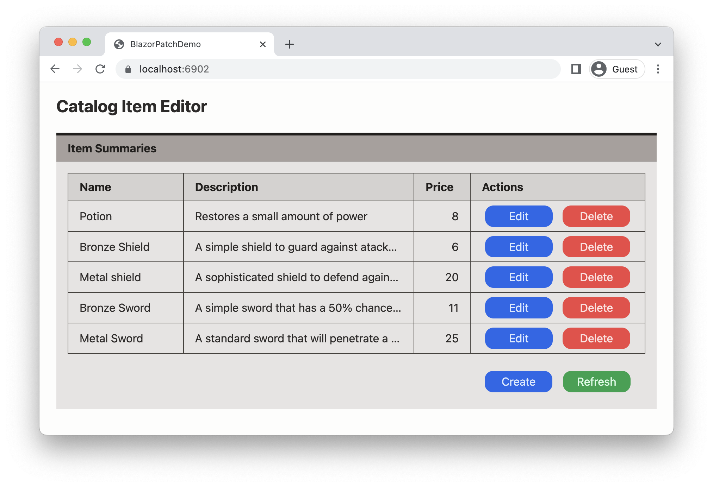

# BlazorPatchDemo

BlazorPatchDemo is a simple App demonstrating one way to provide and consume a RESTfull HTTP based API using C# in the .NET Core technology stack. The emphasis of the demo is on  the PATCH operation, using the proposed [JSON Patch](https://www.rfc-editor.org/info/rfc6902) standard. 
The demo consists of a Blazor WASM Client, an ASP.NET Core based Server, and a shared Library.

The Server has the dual role of hosting the Client and providing the API to the Client. It also persists the resources exposed by the HTTP API as entities in a MongoDB database (running in a Docker container). The Client is a Blazor SPA, providing a basic UI for the manipulation of said resources. Finally, the Shared Library provides the entity class that is shared between the Client and the Server, as well as the DTOs used to transfer representations of the resources between the two. 

## Resources

The App implements a single type of resource, called `Item`. An `Item` represents a product in a catalog containing `Id`, `Name`, `Description`, `Price`, and `DateCreated` properties. These are just enough to show "meaningful" operations.
Below is a screenshot of the UI, after loading some sample Items from the Server. The summaries panel shows the editable properties of an `Item` and provides buttons for editing and deleting them, for creating a new Item, and for refreshing the list of Items.



## Operations, Representations, and Routes

The API exposes the standard HTTP operations as defined in [RFC-9110 HTTP Semantics](https://www.rfc-editor.org/rfc/rfc9110) and [RFC-5789 PATCH Method for HTTP](https://www.rfc-editor.org/rfc/rfc5789):

* GET - to obtain a representation of a single `Item` or a list of representations of all `Item`s.
* POST - to create a new `Item`.
* PUT - to update an existing `Item` in full.
* PATCH - to partially update an existing `Item`.
* DELETE - to delete an `Item`.

The Client uses these operations to manipulate the resources maintained by the Server.
While we generally think in terms of the resource itself (i.e. te `Item` entity), in the REST architectural style -and hence in this API- all interactions are based on representations of the resource (REST stands for REpresentation State Transfer after all). 
These representations are embodied in Data Transfer Objects, or DTOs. Three types of DTOs have been defined:

* `ItemDto` - representing the full resource state, so that the Client can obtain a snapshot of the resource state and use that to construct a local copy of the resource;
* `ItemForCreateDto` - representing the data (state) required to create a new resource on the Server;
* `ItemForUpdateDto` - representing (the subset of) the state to be changed. 

The resources are identified by a resource URI, also know as the URL, path, or route. In this demo those URLs are:

* {base-address}/item - for the collection of all items;
* {base-address}/item/{id} - for the single `Item` with `Id` id

Here {base-address} is determined by where the Server is hosting the resources.
When run in a local development environment, that would be:

* http://localhost:5789/
* https://localhost:6902/ 

_Note_: the port numbers are configurable in the Server project's `launchSettings.json` file.

## Design

Some of the (opiniated) specification / design decisions are:

* The Server is responsible for the generation of the `Id`, As a consequence, PUT can not be used to create a new `Item`, as that would require the Client to provide an Id too. Thus, a PUT on a path with a nonexistent `Id` will return a 404 `Not Found` result.

    _Note_: this decision allows the Server to use the Database to generate entity keys (i.e. the `Item.Id`).
    
* The Server is responsible for setting the `DateCreated` property on the Item entity. Also, it will always use UTC time stamps.

* All communication between the Client and Server will use JSON as the transfer media type for the DTOs using the 

    ```Content-Type: application/json;```

    header.
    Note it would be relatively easy to add support for XML, but that would not play nice with JSON PATCH ...

* For the PATCH operation the [RFC-6902 JavaScript Object Notation (JSON) Patch](https://www.rfc-editor.org/rfc/rfc6902.html) format (a proposed standard) was chosen as the representation of the patch to be applied. From that RFC:
>    JSON Patch defines a JSON document structure for expressing a
>    sequence of operations to apply to a JavaScript Object Notation
>    (JSON) document; it is suitable for use with the HTTP PATCH method.
>    The "application/json-patch+json" media type is used to identify such
>    patch documents.

    The following is an example of the JSON Patch document that could be used to change the `Name` and `Price` of an `Item`

    ```json
    [
      {
        "op": "replace",
        "path": "/Name",
        "value": "Small Bronze Shield"
      },
      {
        "op": "replace",
        "path": "/Price",
        "value": 5
      }
    ]
    ```
    
    Essentially it is an array of operations, with as possibilities `add`, `remove`, `replace`, `move`, `copy`, and `test` that operate on the target JSON document. The document and the path specification can be arbitrarily complex c.q. deep. It also allows elements of arrays to be manipulated.
    
    An alternative format would have been [RFC-7386JSON Merge Patch](https://www.rfc-editor.org/rfc/rfc7396.html), which also is a proposed standard.
    The Merge Patch is simpler, but less powerful. The same patch operation as above would have been encoded as:
    
    ```json
    {
      "Name": "Small Bronze Shield",
      "Price": 5
    }
    ```
    
    Yann Normand has written a very clear blog post on [JSON Merge Patch in .NET Core ](https://dev.to/onlyann/json-merge-patch-in-net-core-2g7e), in case you are interested.

* For pragmatic reasons, and to demonstrate both PUT and PATCH as methods to update a resource, PUT will be used when the`Description` property has been changed, and PATCH if it is unchanged.
The "logic" behind this is that the `Description` could be large and then we might as well send the full `ItemForUdateDto` and not have the overhead of the JSON Patch `op` and `value` fields and processing them.

* DELETE will return a 204 `No Content` response if the resource did not exist (also if it did exist, obviously). The rationale is that the post condition of delete has been met.

## Running the demo

The demo is a standard .NET 7 solution, just download and run from your favourite IDE or from the dotnet command line.

The Server needs access to a MongoDB (compatible) database server. The rootfolder of te solution contains a `docker-compose.yml` file that will run MongoDB in a Docker container (assuming Docker Desktop has been installed and is running ....).
Alternatively edit the `appsettings.json` file to provide an alternative database server.

#### Error Injection

To simulate connection and server errors, but also to test Client error handling, 
the Server will randomly (p = 20%) return an error instead of performing the requested operation.
This can easily be turned off in the Server's `ItemsController.cs` file.

#### Swagger UI

In the development configuration, the Server generates and serves a Swagger UI page tha can be reached from the menu entry in the App's heading. This will open in a new browser tab.

## Limitations

This demo has (at least ;-) the following limitations:

* **No security** - it is solely intended as a starting point and to run locally in a development environment.

* **No guards against parallel updates** - all API operations work directly on the server, edits or deletes done from another browser window will not be detected and can be overwritten when updating a resource using PUT or PATCH (a.k.a. "the lost update problem"). 

    The correct solution would be to use [ETags](https://developer.mozilla.org/en-US/docs/Web/HTTP/Headers/ETag) and the `If-xxx` family of headers. The update algorithm would be along these lines:

    1. Before editing an Item, the Client issues a GET on the "items/{Id}" route with the `If-None-Match: "{ETag}` (and with an empty ETag value if it is unknown).

    1. The Server responds either with a 304 `Not Modified` or with a fresh copy (and its new ETag value). 

    1. The Client displays the (new) Item's properties in the Editor panel for the human user to change at will.

    1. Upon "submit", the Client either issues a PATCH or PUT request with the `If-Match: "{ETag}` header set.
    
    1. The Server validates the ETag agains its current resource value. If the resource was modified, the ETag will not match and the Server must respond with a 412 `Precondition Failed` Status Code. It is then up to the Client to decide what to do, e.g. give the human user a warning and start over at step 1. If the resource was not modified, it will execute the update and respond as before.

    Note that DELETE is not a problem, as deleting a non-existing resource is handled as a success (the post condition has been met after all).  

* **Requires Newtonsoft Json.NET** - the standard .Net System.Text.Json serializer cannot serialize or deserialize the `JsonPatchDocument<T>` type, which is used to represent a JSON Patch document as a .NET object. In stead, the (excellent) Newtonsoft [Json.NET](https://www.newtonsoft.com/json/help/html/Introduction.htm) serializer must be used.

* **No generic Patch generation logic** - the demo uses a -very naive- and custom `Item` comparator to drive the creation of the `JsonPatchDocument<Item>`object.
I have not yet found a generic solution that is supported in .NET; however there are quite a few chhange request for that in the .NET repository.

 Using one of the answers to [this Stackoverflow question](https://stackoverflow.com/questions/43692053/how-can-i-create-a-jsonpatchdocument-from-comparing-two-c-sharp-objects#50011301), I found this generic [PatchHelper](https://gist.github.com/yww325/b71563462cb5b5f2ea29e0143634bebe) solution that uses recursive descent to compare two JSON representations of the objects to compare. Please note I have not (yet) evaluated it, ymmv.

## Possible Improvements

* Address any of the limitations described above.

* Add a `LastUpdated` property to Item, so that the PUT and PATCH operations set that value upon change. This would also justify returning a `ItemDto` representation upon successful updates, to let the Client know the new value (obviously it would be the Server's responsibility to set that value).

* More robust HTTP request generation / handling. Currently some use the `XxxAsJson()` methods on the `HttpClient` object. This works fine if there are no errors, but there are safer and more efficient ways of issuing requests in ASP.NET Core.

* Make the random Server generated errors (or their likelyhood) a configuration parameter.

* Replace the Item Summaries panel's HTML `<table>` element with a proper grid component, e.g. the new [QuickGrid](https://learn.microsoft.com/en-us/aspnet/core/blazor/components/?view=aspnetcore-7.0#quickgrid-component). At a minimum, limit its height.
 
## References

* Microsoft Learn: [JsonPatch in ASP.NET Core web API](https://learn.microsoft.com/en-us/aspnet/core/web-api/jsonpatch?view=aspnetcore-7.0).

* CodeMaze: [Using HttpClient to Send HTTP PATCH Requests in ASP.NET Core](https://code-maze.com/using-httpclient-to-send-http-patch-requests-in-asp-net-core/).

* jsonpatch.com: [general info about JSONPatch](https://jsonpatch.com/)

* Yann Normand: [JSON Merge Patch in .NET Core](https://dev.to/onlyann/json-merge-patch-in-net-core-2g7e).

* Mozilla Developer: [ETag](https://developer.mozilla.org/en-US/docs/Web/HTTP/Headers/ETag)

* IETF: Dusseault, L. and J. Snell, "PATCH Method for HTTP", RFC 5789, DOI 10.17487/RFC5789, March 2010, <[https://www.rfc-editor.org/info/rfc5789](https://www.rfc-editor.org/info/rfc5789)>.

* IETF: Bryan, P., Ed., and M. Nottingham, Ed., "JavaScript Object Notation (JSON) Patch", RFC 6902, DOI 10.17487/RFC6902, April 2013, <[https://www.rfc-editor.org/info/rfc6902](https://www.rfc-editor.org/info/rfc6902)>.

* IETF: Hoffman, P. and J. Snell, "JSON Merge Patch", RFC 7396, DOI 10.17487/RFC7396, October 2014, <[https://www.rfc-editor.org/info/rfc7396](https://www.rfc-editor.org/info/rfc7396)>.

* IETF: Fielding, R., Ed., Nottingham, M., Ed., and J. Reschke, Ed., "HTTP Semantics", STD 97, RFC 9110, DOI 10.17487/RFC9110, June 2022, <[https://www.rfc-editor.org/info/rfc9110](https://www.rfc-editor.org/info/rfc9110)>.

## Finally

Kudos to those who noticed the correspondence between the port numbers and the RFC numbers ;-).

