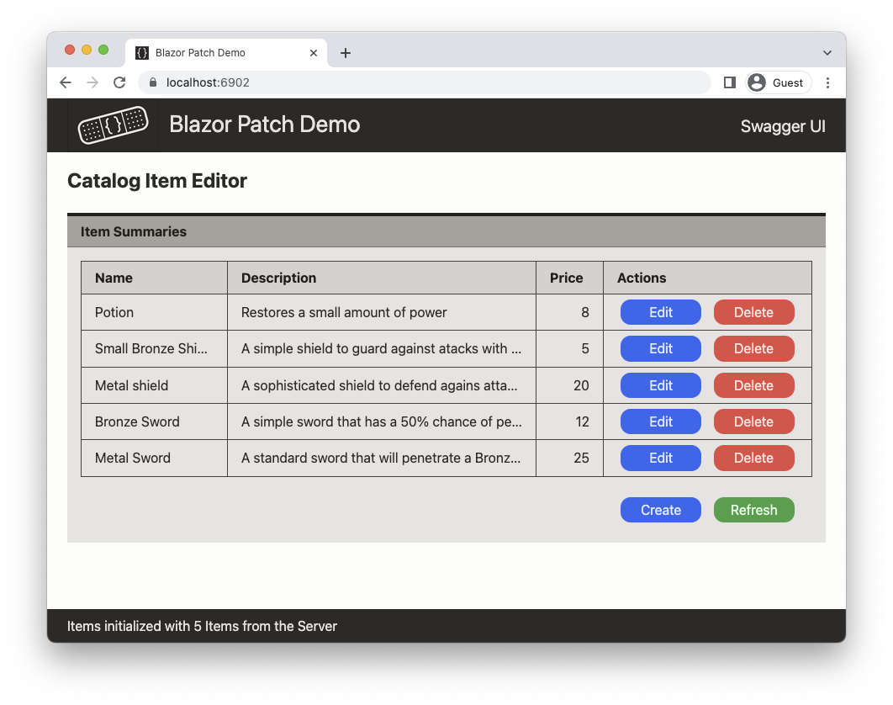

# BlazorPatchDemo

BlazorPatchDemo is a simple App demonstrating one way to provide and consume a RESTfull interface using an HTTP API using C# in the .NET Core technology stack. The emphasis of the demo is on  the PATCH operation when using the proposed [JSON Patch standard](https://www.rfc-editor.org/info/rfc6902)). The demo consists of a Blazor WASM Client, an ASP.NET Core based Server, and a shared Library.

The Server has the dual role of hosting the Client and providing the HTTP API to the Client. It also persists the resources exposed by the API as Entities in a MongoDB database (running in a Docker container). The Client is a Blazor SPA, providing a basic UI for the manipulation of said resources / Entities. Finally, the Shared Library provides the Entity class that is shared between the Client and the Server, as well as the DTOs used to transfer representations of those Entities between the two. 

The App implements only a single type of resource, called `Item`. An `Item` represenst a product in a catalog containing an `Id`, `Name`, `Description`, `Price`, and `DateCreated` property. These are just enough to show "meaningfull" operations.
Below is a screenshot of the UI after loadig the items from the Server showing the editable properties of an `Item` with some sample data loades:



The demo's API exposes the standard HTTP operations:

* GET to obtain a representation of a single `Item` or a list of representations of all `Item`s;
* POST to create a new `Item`;
* PUT to update an existing `Item` in full;
* PATCH to partially update an existing `Item`;
* DELETE to delete an `Item`.

The Client uses these operations to manipulate the resources maintained by the Server.
While we generally think in terms of the resource itself (i.e. te `Item` entity), in the REST architectural style, and hence in this API, all interactions use representations of the resource (REST stands for REpresentation State Transfer after all). 
These representations are embodied in Data Transfer Objects, or DTOs. Three types of DTOs have been defined:

* `ItemDto` representing the full resource state, so that the Client can obtain a snapshot of the resorce state and use that to construct a local copy of the resource;
* `ItemForCreateDto` representing the data (state) required to create a new resource on the Server;
* `ItemForUpdateDto` representing the (subset of the) state to be changed. 

The resources are identified by a resource URI, commonly know as the URL or path. In this demo those URLs are:

* {base-address}/item for the collection of all items;
* {base-address}/item/{id} for the single `Item` with `Id` id

Here {base-address} is determined by where the Server is hosting the resources, but when run in a local development envirionment that would, out of the box, be:

* http://localhost:5789/
* https://localhost:6902/ 

_Note_: the port numbers are configurable in the Server project's `launchSettings.json` file.

Some of the (opiniated) design decisions are:

* The Server is responsible for the generation of the `Id`, As a consequence, PUT can not be used to create a new `Item`, as that would require the Client to provide an Id to. Thus, a PUT on a path with a nonexisting Id will return a 404 Not Found result.

    Note this would allow the Server to let the Database generate the keys.

* All communication between the Client and Server will use JSON as the transfer media type (`Content-Type: application/json;`) for the DTOs.

* For the PATCH operation the JSON Patch document format (a proposed IETF standard, see below) was choosen as the representation of the patch to be applied. From the IETF spec:
>    JSON Patch defines a JSON document structure for expressing a
>    sequence of operations to apply to a JavaScript Object Notation
>    (JSON) document; it is suitable for use with the HTTP PATCH method.
>    The "application/json-patch+json" media type is used to identify such
>    patch documents.

    An alternative would have been to use the JSON Merge Patch format, which also is a proposed IETF standard.
    However, that -imho- fits less well with a statically typed language such as C# (although one could make it work).

    The following is an example of the JSON Patch document that could be used to change the `Name` and `Price` of an `Item`

    ```json
    [
      {
        "op": "replace",
        "path": "/Name",
        "value": "Small Bronze Shield"
      },
      {
        "op": "replace",
        "path": "/Price",
        "value": 5
      }
    ]
    ```
* For pragmatic reasons and to demonstrate both PUT and PATCH as methods to updat a resource, PUT will be used when the`Description` property has been changed, and PATCH if it is unchanged.
The "logic" beheind this is that the `Description` coukd be large and then we might as well send thhe full `ItemForUdateDto` and not have the overhead of the JSON Patch `op` and `value` fields.

### Running the demo

The demo is a standard .NET 7 solution, just download and run from your favourite IDE or from the dotnet command line.

The Server needs access to a MongoDB (compatible) database server. The rootfolder of te solution contains a `docker-compose.yml` file that will run MongoDB in a Docker container (assuming Docker Desktop has been installed and is running ....).
Alternatively edit the `appsettings.json` file to provide an alternative database server.

#### Error Injection

To simulate connection and server errors, and also to test Client error handling, 
the Server will randomly (p = 20%) return an error in stead of performing the requested operation.
This can easily be turned off in the Server's `ItemsController.cs` file.

### Limitations

This demo has (at least ;-) the following limitations:

* **No security** - it is solely intended as a starting point and to run locally in a development environment.

* **No guards against parallel updates** - all API operations work directly on the server, edits or deletes done from another browser window will not be detected an can be overwritten using when updating a resource (using PUT or PATCH).

* **Requires Newtonsoft Json.NET** - the standard .Net System.Text.Json serializer cannot serialize or deserialize the `JsonPatchDocument<T>` type, which is used to represent a JSON Patch document as a .NET object. In stead, the (excellent) Newtonsoft [Json.NET](https://www.newtonsoft.com/json/help/html/Introduction.htm) serializer must be used.

* **No generic Patch generation logic** - the demo uses a -very naive- and custom `Item` comparator to drive the creation of the `JsonPatchDocument<Item>`object.
I have not yet found a generic solution that is supported in .NET; however there are quite a few chhange request for that in the .NET repository.

Using one of the answers to [this Stackoverflow question](https://stackoverflow.com/questions/43692053/how-can-i-create-a-jsonpatchdocument-from-comparing-two-c-sharp-objects#50011301), I found this generic [PatchHelper](https://gist.github.com/yww325/b71563462cb5b5f2ea29e0143634bebe) solution that uses recursive descent to compare two JSON representations of the objects to compare. Please note I have not (yet) evaluated it, ymmv.

### References

* Microsoft Learn: [JsonPatch in ASP.NET Core web API](https://learn.microsoft.com/en-us/aspnet/core/web-api/jsonpatch?view=aspnetcore-7.0).

* CodeMaze: [Using HttpClient to Send HTTP PATCH Requests in ASP.NET Core](https://code-maze.com/using-httpclient-to-send-http-patch-requests-in-asp-net-core/).

* jsonpatch.com: [general info about JSONPatch](https://jsonpatch.com/) 

* IETF: Dusseault, L. and J. Snell, "PATCH Method for HTTP", RFC 5789, DOI 10.17487/RFC5789, March 2010, <[https://www.rfc-editor.org/info/rfc5789](https://www.rfc-editor.org/info/rfc5789)>.

* IETF: Bryan, P., Ed., and M. Nottingham, Ed., "JavaScript Object Notation (JSON) Patch", RFC 6902, DOI 10.17487/RFC6902, April 2013, <[https://www.rfc-editor.org/info/rfc6902](https://www.rfc-editor.org/info/rfc6902)>.

* IETF: Hoffman, P. and J. Snell, "JSON Merge Patch", RFC 7396, DOI 10.17487/RFC7396, October 2014, <[https://www.rfc-editor.org/info/rfc7396](https://www.rfc-editor.org/info/rfc7396)>.


